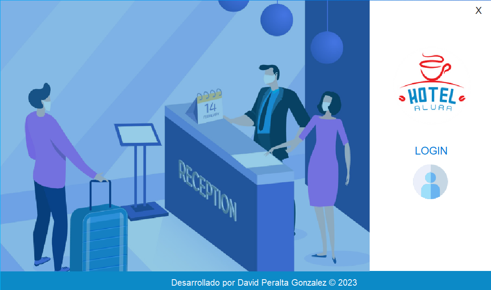
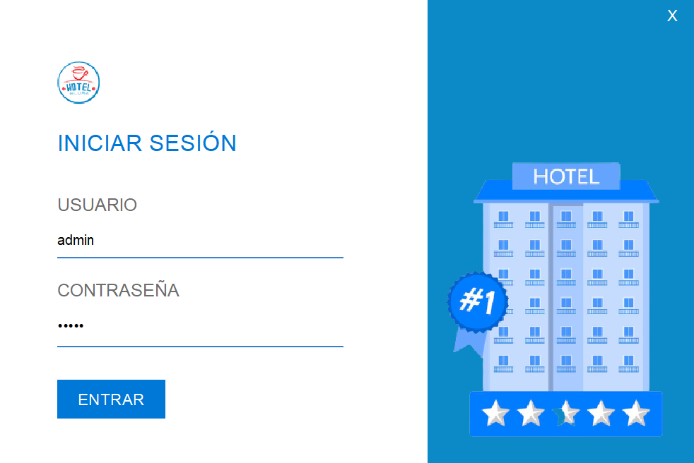
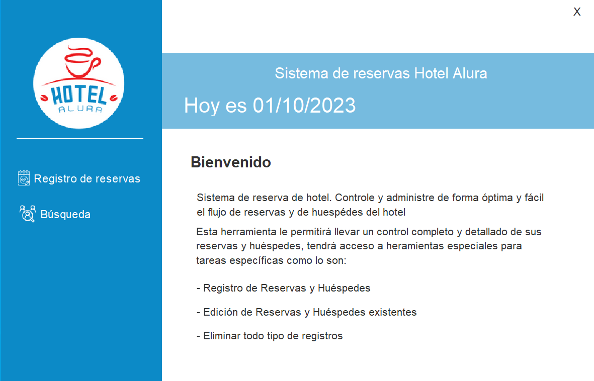
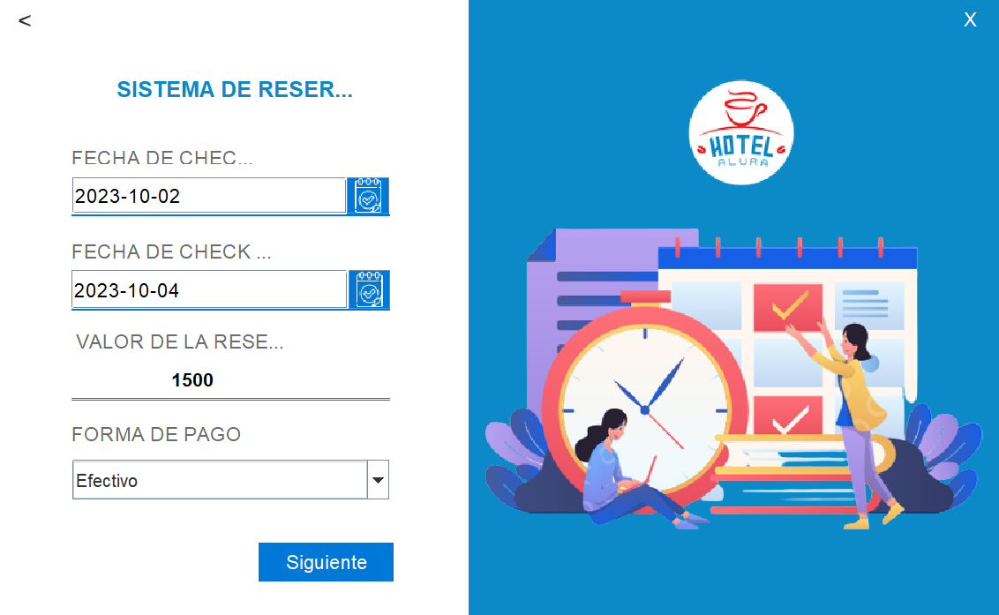
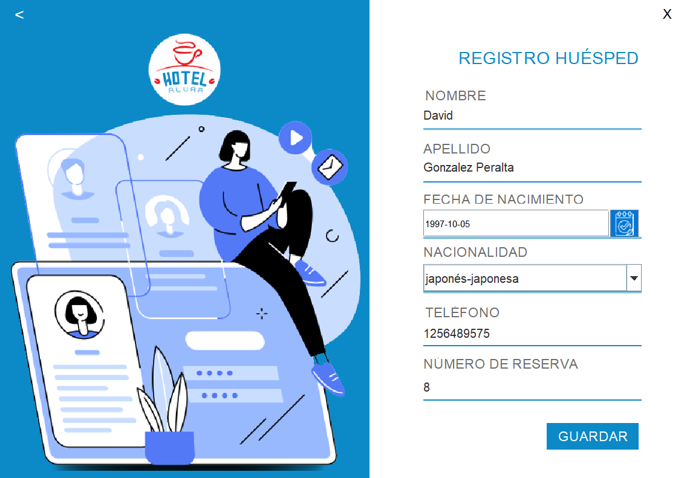
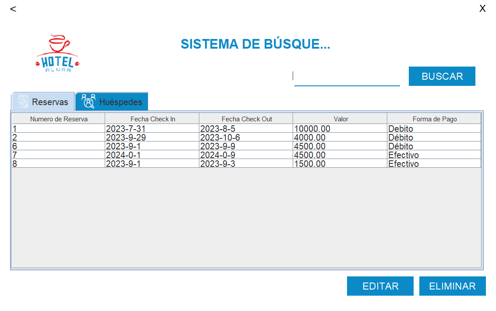
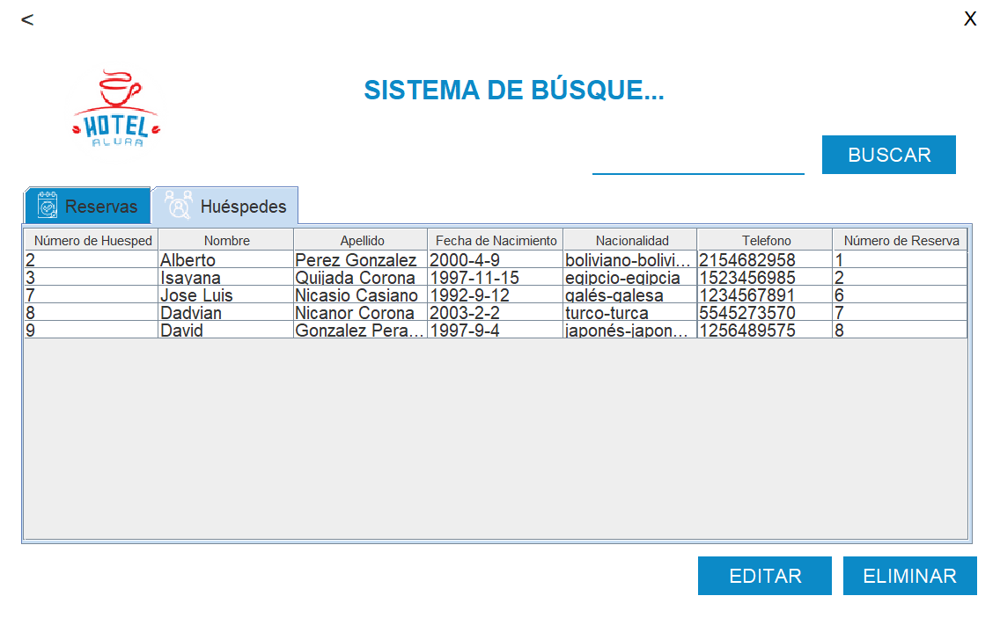

# Challenge ONE | Java | Back-end | Hotel Alura

     

---
## 📄 Descripcion:

El Hotel Alura conocido por su espectaculares instalaciones y paquetes promocionales para Desarrolladores de Software está teniendo problemas para llevar el control de las reservaciones hechas por sus clientes, por eso solicitan nuestra ayuda para desarrollar un sistema de reserva que contenga:

1- Sistema de autenticación de usuario para que solo usuarios pertenecientes al hotel consigan acceder al sistema.
2- Permitir crear, editar y eliminar una reserva para los clientes.
3- Buscar en la base de datos todas las informaciones tanto de los clientes como de las reservas.
4- Registrar, editar y eliminar datos de los huéspedes.
5- Calcular el valor de la reserva en base a la cantidades de días de la reserva y a una tasa diaria que puede ser asignada por ti y en la moneda local de tu país.
6- Base de datos para almacenar todos los datos pedidos anteriormente.

---
## 🖥️ Tecnologías Utilizadas:

- Java
- Maven
- Eclipse
- Biblioteca JCalendar
- MySql
- Plugin WindowBuilder  

---
## 🚧 Proyecto
### 📊 Base de Datos

### 🖥 Vistas

#### 🔹 Menu Principal

#### 🔹 Login

#### 🔹 Munu Usuario

#### 🔹 Registro Reserva

#### 🔹 Registro Huesped

#### 🔹 Busqueda Reserva

#### 🔹 Busqueda Huesped

